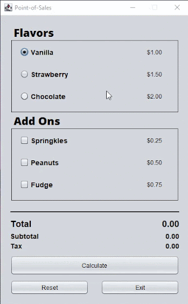

# Event Driven Programming - Point of Sales

## Table of contents

- [Overview](#overview)
  - [Screenshot](#screenshot)
- [My process](#my-process)
  - [Built with](#built-with)
  - [What I learned](#what-i-learned)
- [Author](#author)
- [Acknowledgments](#acknowledgments)

## Overview

### Screenshot

#### Point of Sales Preview
---

## My process

### Built with

- Java Swing

### What I learned

Learned to create a simple PoS system for an ice cream shop where users can select ice cream flavors and toppings, calculate the total cost, reset their selections, and exit the application. The code manages the GUI components and their interactions with the user.

## Author

- Website - [Shanice](https://github.com/sdacleofe/about-me)

## Acknowledgments

I want to express my gratitude to my event-driven programming course instructor for imparting knowledge about the concept of Java GUI to us.

**This laboratory activity was made on March 2, 2022**